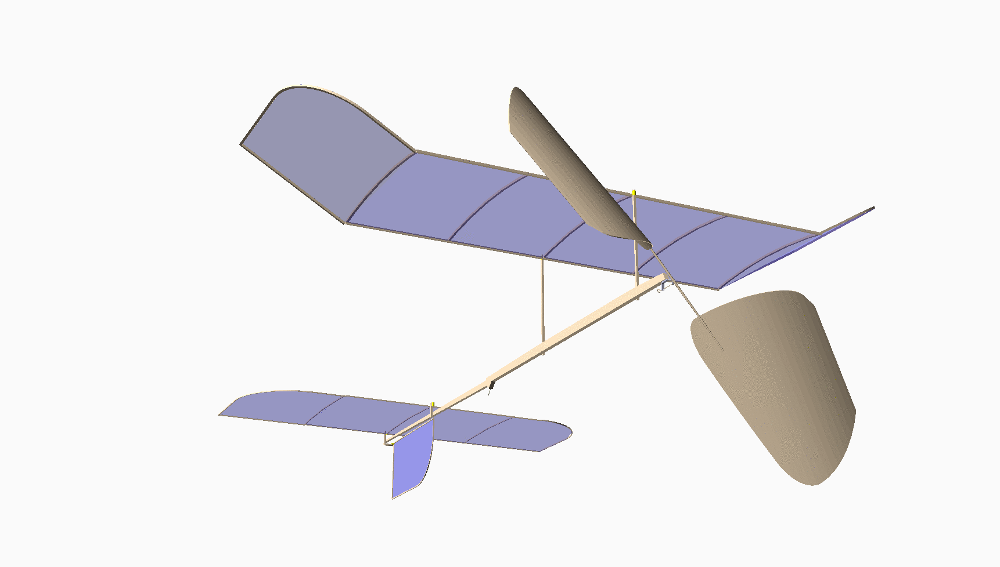

Math Magik (v0.1.6)
####################
:Author:    Roie R. Black
:Email: roie.black@gmail.com
:Docs:      https://rblack42.github.io/math-magik

..  start-badges

.. list-table::
    :stub-columns: 1

    * - tests
      - | |github|

.. |github| image:: https://github.com/rblack42/math-magik/actions/workflows/main.yml/badge.svg
    :alt: Github Workflows
    :target: https://github.com/rblack42/math-magik

.. end-badges

This project uses OpenSCAD_ and a few supporting libraries to generate 3D models
of free-flight model airplanes. The accompanying Python software assists
in creating a design and performs analysis on the design to produce an estimate
of the weight and center of gravity of the design. This project is the subject
of an article in the 2021 edition of the National Free Flight Society
Symposium.

The project documentation is available at the link above. There you will find
material detailing the Python code developed to support this project, and
information on how OpenSCAD_ can be used to build 3D models of proposed designs.
The primary focus of this documentation is the design of a Limited Pennyplane
indoor model, but other designs will be included here as well.

If you are interested in assisting with the development of this project, or
need help with anything found here, please contact me by email. I welcome
questions and ideas for extending this project.

