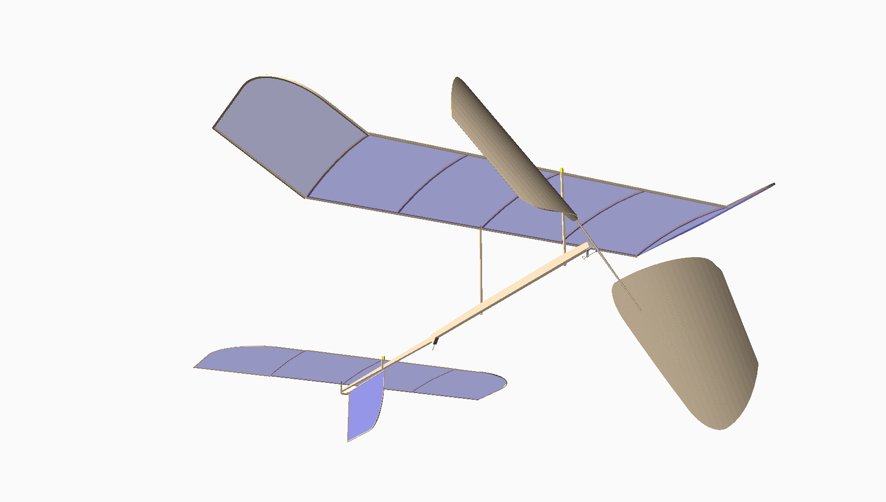

Math Magik (v0.1.3)
####################
:Author:    Roie R. Black
:Email: roie.black@gmail.com
:Docs:      https://rblack42.github.io/math-magik

..  start-badges

.. list-table::
    :stub-columns: 1

    * - tests
      - | |travis| |appveyor| |coverage| |requires|
    * - package
      - | |version| |wheel| |supported-versions|
        | |commits-since|

.. |travis| image:: https://api.travis-ci.com/rblack42/math-magik.svg?branch=master
    :alt: Travis-CI Build Status
    :target: https://travis-ci.com/rblack42/math-magik

.. |appveyor| image:: https://ci.appveyor.com/api/projects/status/github/rblack42/math-magik?branch=master&svg=true
    :alt: AppVeyor Build Status
    :target: https://ci.appveyor.com/project/rblack42/math-magik

.. |requires| image:: https://requires.io/github/rblack42/math-magik/requirements.svg?branch=master
    :alt: Requirements Status
    :target: https://requires.io/github/rblack42/math-magik/requirements/?branch=master

.. |version| image:: https://img.shields.io/pypi/v/math-magik.svg
    :alt: PyPI Package latest release
    :target: https://pypi.org/project/math-magik

.. |wheel| image:: https://img.shields.io/pypi/wheel/math-magik.svg
    :alt: PyPI Wheel
    :target: https://pypi.org/project/math-magik

.. |supported-versions| image:: https://img.shields.io/pypi/pyversions/math-magik.svg
    :alt: Supported versions
    :target: https://pypi.org/project/math-magik

.. |supported-implementations| image:: https://img.shields.io/pypi/implementation/math-magik.svg
    :alt: Supported implementations
    :target: https://pypi.org/project/math-magik

.. |commits-since| image:: https://img.shields.io/github/commits-since/rblack42/math-magik/v0.0.17.svg
    :alt: Commits since latest release
    :target: https://github.com/rblack42/math-magik/compare/v0.0.17...master

..  |coverage| image:: https://coveralls.io/repos/github/rblack42/math-magik/badge.svg
    :target: https://coveralls.io/github/rblack42/math-magic
    :alt: Code Coverage"

.. end-badges

This project used OpenSCAD and a few supporting libraries to generate 3D models
of indoor free-flight model airplanes. The accompanying Python software assists
in creating a design and performs analysis on the design to produce an estimate
of the weight and center of gravity of the design. This project is the subject
of an article in the 2021 edition of the National Free Flight Society
Symposium.

